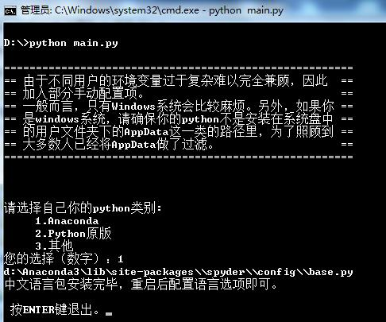
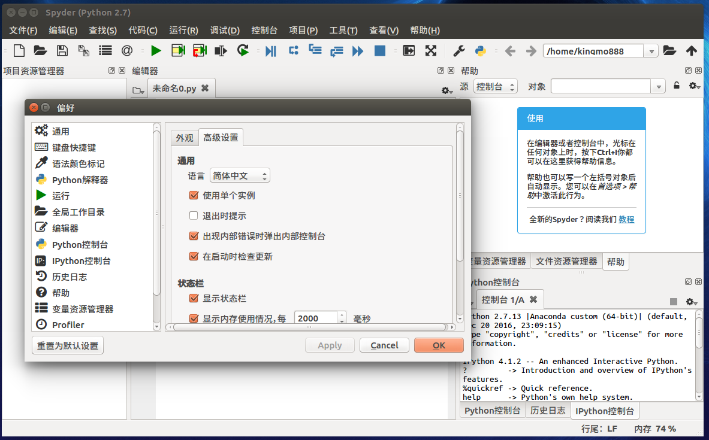
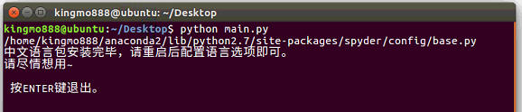
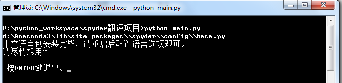
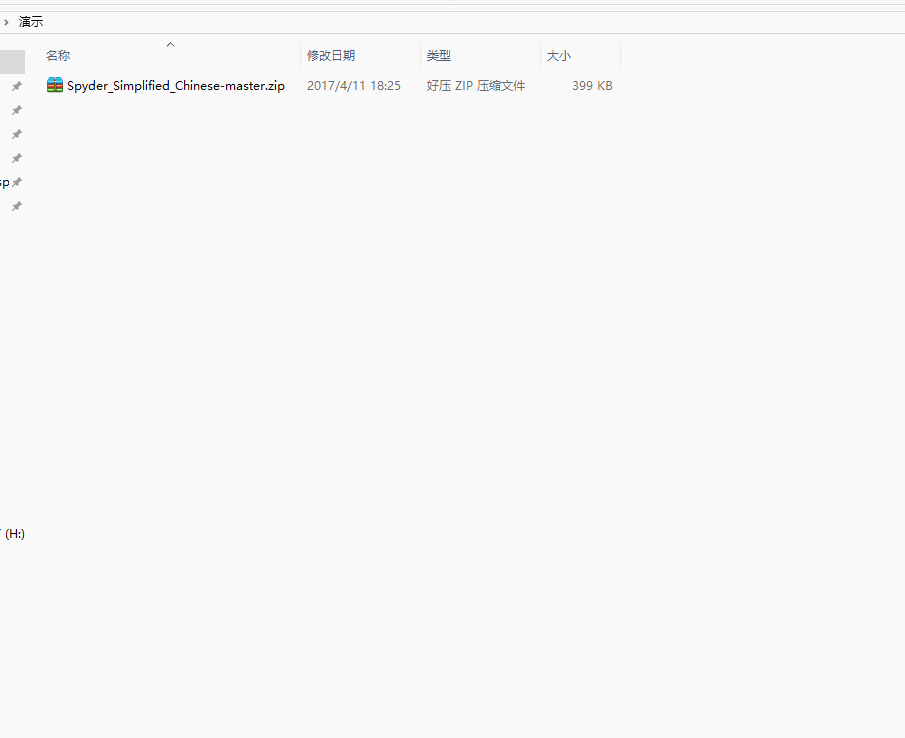

如果安装出现什么问题，可以Q群交流一下

QQ群：599383129 

2018-07-04:
更新部分翻译内容，对Spyder新版中的新增核心内容做了更新。
更新了汉化代码的执行逻辑。

============================================

2017-11-13:
CMD下执行python main.py出现以下错误时，
>PermissionError:[WinError 5]拒绝访问。：

是因为python环境在系统盘。此时cmd需要管理权限，右击cmd以管理身份运行，再次执行Python main.py即可。

2017-10-31:
解决各种编码问题，最突出的问题就是：

TypeError: 'encoding' in an invalid keyword argument for this function

这是由于Python2.x对文件支持问题导致的，已经修复。还有一些诸如编码神马的问题也一并修复。

============================================

** 请务必忽略截图中的错别字（人工捂脸**

Spyder在3.x版本之后开始支持自定义语言包。

虽然使用无障碍，还是想上一个中文包，毕竟还是好多朋友找这个汉化包。

这就是汉化包的由来啦。

============================================
该汉化包已pull到Spyder官方，目前等待合并。合并后更新Spyder到最新版即可使用中文语言了，在此之前如果想尝试的话，可以使用一键安装脚本来安装。

## Q&A:
[1、Linux下，提示base.py文件不存在的问题（含解决办法）](https://github.com/kingmo888/Spyder_Simplified_Chinese/issues/2)

### 必备条件：
>1、已安装Spyder
>
>2、Spyder版本在3.X以上。

### Spyder安装：
>1、anaconda下，conda install spyder
>
>2、Python发行版下， pip install spyder

### Spyder升级：
>1、anaconda下，conda update spyder
>
>2、Python发行版下，pip install --upgrade spyder

## 汉化包的安装(文尾有详细方法)：
如果python环境首选路径是anaconda的话，在main.py所在路径打开命令行或者终端，输入一下命令即可：
> python main.py

Ubuntu：

Windows:

安装完成后，打开或重启Spyder，在偏好设置中，选择简体中文，重启即可。

## 详细安装方法

1、假设已经通过git命令或者直接下载zip文件并解压到目录A。

**目录A下有spyder.mo，main.py，readme.md等文件。

2、如果是windows系统，在目录A下，再选择任何文件的情况下(可以先左键单击空白处)，按住Shift的同时在空白处单击右键，调出菜单
，此时菜单中会出现【在此处打开命令窗口】的选项，打开。

3、在弹出的命令窗口中输入：

>python main.py 

回车执行即可。
（如果是Linux系统，右键打开终端，输入同样命令。）